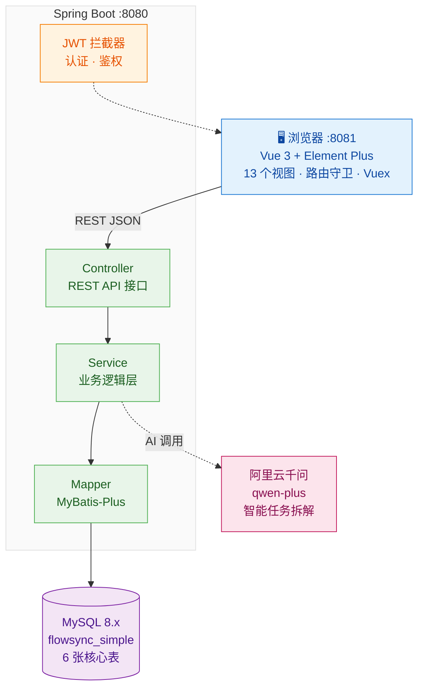
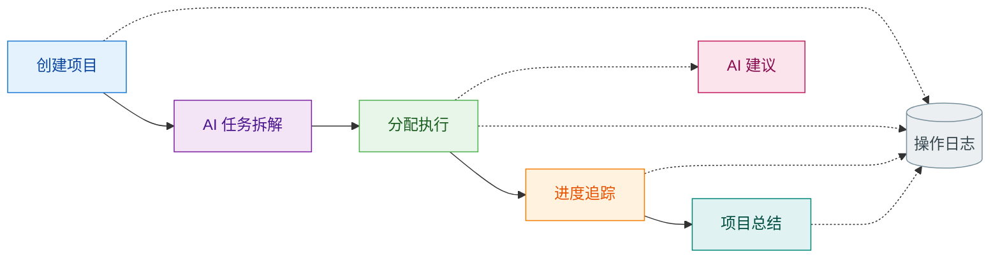

<div align="center">

# FlowSync

**小组任务协同管理系统** — Vue 3 + Spring Boot + 阿里云千问 AI


</div>

---

## 系统架构



## 用户工作流



---

## 功能模块

| 模块 | 说明 |
|------|------|
| 🔐 **登录认证** | JWT Token · 路由拦截 · 三种角色（负责人/成员） |
| 📊 **工作台** | 成员 · 项目 · 任务 · 总结 一站总览 |
| 📁 **项目管理** | CRUD · 负责人 · 状态/优先级 · 时间范围 |
| ✅ **任务管理** | 父子任务 · 筛选 · 甘特图 · AI 建议 |
| 🤖 **AI 拆解** | 千问智能分解 · 一键导入 · 无 Key 自动兜底 |
| 📈 **进度跟踪** | 实时进度 · 按任务筛选 · 修改记录 |
| 📝 **总结中心** | 项目/任务/阶段 多类型总结 |
| 👥 **成员管理** | 成员列表 · 个人信息 · 密码修改 |
| 📋 **操作日志** | 关键操作审计 · 全程可追溯 |

---

## 技术栈

| 层级 | 技术 | 端口 |
|------|------|:--:|
| 前端 | Vue 3 + Element Plus + Vue Router + Axios | 8081 |
| 后端 | Spring Boot 3.3.5 + MyBatis-Plus 3.5.8 | 8080 |
| 数据库 | MySQL 8.x | 3306 |
| API 文档 | SpringDoc OpenAPI (Swagger) | — |
| AI | 阿里云千问 qwen-plus | — |

---

## 快速开始

### 1. 初始化数据库

```sql
source backend/database/flowsync_simple.sql;
```

### 2. 启动后端

```bash
cd backend
./mvnw spring-boot:run
# Swagger: http://localhost:8080/swagger-ui/index.html
```

### 3. 启动前端

```bash
cd frontend
npm install && npm run serve
# 访问: http://localhost:8081
```

### 4. 测试账号

| 角色 | 账号 | 密码 |
|------|------|------|
| 负责人 | `leader` | `123456` |
| 成员 | `member1` | `123456` |
| 成员 | `member2` | `123456` |

### 5. AI 配置（可选）

```powershell
$env:DASHSCOPE_API_KEY="sk-your-api-key"
```

> 未配置时 AI 接口自动返回教学兜底结果，其他模块不受影响。

---

## 目录结构

```
FlowSync/
├── frontend/                    Vue 3 前端
│   └── src/
│       ├── api/        🌐 Axios 请求层
│       ├── router/     🧭 路由配置
│       ├── store/      🗃️ Vuex 状态管理
│       ├── views/      🎨 13 个页面组件
│       └── utils/      🔧 认证 · 分页 · 工具
│
├── backend/                     Spring Boot 后端
│   └── src/main/java/hgc/flowsyncapi/
│       ├── controller/ 📡 REST 控制器
│       ├── service/    ⚙️ 业务逻辑
│       ├── mapper/     🗄️ MyBatis-Plus
│       ├── entity/     📦 数据库实体
│       ├── dto/        📋 数据传输对象
│       ├── common/     🧩 统一响应 · 异常
│       └── config/     🔐 拦截器 · Web · OpenAPI
│
├── backend/database/            📜 flowsync_simple.sql
├── docs/                        📖 需求文档 · 启动说明 · 实现对照
└── README.md
```

---

## 数据库表

| 表名 | 用途 |
|------|------|
| `sys_user` | 用户（账号/密码/角色/联系方式） |
| `project_info` | 项目（名称/状态/优先级/负责人/时间） |
| `task_info` | 任务（标题/描述/指派人/状态/优先级/AI建议） |
| `task_log` | 任务进度记录 |
| `task_summary` | 任务总结（项目/任务/阶段） |
| `operation_log` | 操作审计日志 |

---

## 协作者

<table>
<tr>
<td align="center"><b>Ravier-Xring</b><br/>全栈开发 · 50%</td>
<td align="center"><b>Kayblis576</b><br/>全栈开发 · 50%</td>
</tr>
</table>

---

## License

仅供学习交流使用。
