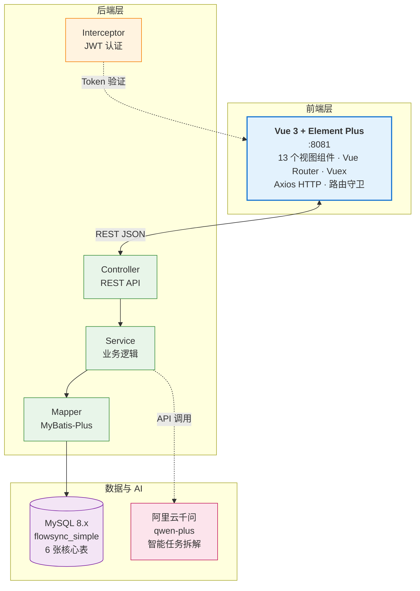
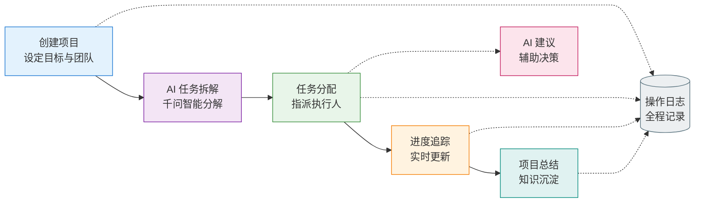
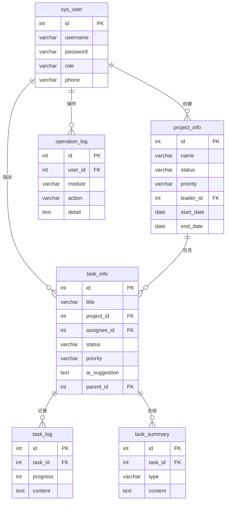

<p align="center">
  
  
  
  
  
</p>

<h1 align="center">FlowSync</h1>

<p align="center"><b>小组任务协同管理系统</b> — Vue 3 + Spring Boot + 阿里云千问 AI 智能拆解</p>

<p align="center">
  <a href="#快速开始">快速开始</a> ·
  <a href="#架构总览">架构总览</a> ·
  <a href="#功能模块">功能模块</a> ·
  <a href="#项目结构">项目结构</a> ·
  <a href="#协作者">协作者</a>
</p>

---

## 架构总览



### 用户工作流



---

## 功能模块

| 模块 | 说明 | 关键能力 |
|------|------|---------|
| 🔐 **登录认证** | JWT Token · 路由拦截 · 登录态管理 | 三种角色：负责人/成员 |
| 📊 **工作台** | 成员数 · 项目数 · 任务数 · 总结数 | 一站式数据总览 |
| 📁 **项目管理** | CRUD · 状态/优先级/时间范围 | 负责人指派 |
| ✅ **任务管理** | 父子任务 · 筛选 · AI 建议 · 甘特图 | 全生命周期管理 |
| 🤖 **AI 拆解** | 千问智能分解 · 一键导入 | 无 Key 自动兜底 |
| 📈 **进度跟踪** | 实时进度 · 按任务筛选 · 记录列表 | 可视化追踪 |
| 📝 **总结中心** | 多类型总结 · 项目/任务/阶段 | 知识沉淀 |
| 👥 **成员管理** | 成员列表 · 个人信息 · 密码修改 | 团队协作 |
| 📋 **操作日志** | 关键操作审计 · 操作人 · 时间戳 | 全程可追溯 |

---

## 技术栈

| 层级 | 技术 | 版本 | 端口 |
|------|------|------|:--:|
| 前端框架 | Vue 3 | 3.x | 8081 |
| 路由 | Vue Router | 4.x | — |
| UI 组件 | Element Plus | latest | — |
| HTTP 客户端 | Axios | latest | — |
| 后端框架 | Spring Boot | 3.3.5 | 8080 |
| ORM | MyBatis-Plus | 3.5.8 | — |
| 数据库 | MySQL | 8.x | 3306 |
| API 文档 | SpringDoc OpenAPI | latest | Swagger |
| AI | 阿里云千问 | qwen-plus | — |

```text
🤖 AI 说明：未配置 DashScope API Key 时，AI 接口自动返回教学兜底方案，不影响其他模块
```

---

## 快速开始

### 1. 初始化数据库

```sql
-- 执行建库脚本（含测试数据）
source backend/database/flowsync_simple.sql;
```

### 2. 启动后端

```bash
cd backend

# Windows
.\mvnw.cmd spring-boot:run

# Linux / macOS
./mvnw spring-boot:run
```

> 数据库账号非默认时：`$env:DB_USERNAME="xxx"; $env:DB_PASSWORD="xxx"`

Swagger 文档：http://localhost:8080/swagger-ui/index.html

### 3. 启动前端

```bash
cd frontend
npm install
npm run serve
```

访问：http://localhost:8081

### 4. 测试账号

| 角色 | 账号 | 密码 |
|------|------|------|
| 负责人 | `leader` | `123456` |
| 成员 | `member1` | `123456` |
| 成员 | `member2` | `123456` |

### 5. AI 配置（可选）

```powershell
$env:DASHSCOPE_API_KEY="sk-your-api-key"
```

---

## 项目结构

```text
FlowSync/
├── frontend/                          # Vue 3 前端
│   ├── src/
│   │   ├── api/          🌐 Axios 请求层
│   │   ├── router/       🧭 路由配置
│   │   ├── store/        🗃️ Vuex 状态管理
│   │   ├── views/        🎨 13 个页面组件
│   │   ├── utils/        🔧 认证/分页工具
│   │   └── styles/       💅 全局样式
│   ├── vue.config.js
│   └── package.json
│
├── backend/                           # Spring Boot 后端
│   ├── src/main/java/hgc/flowsyncapi/
│   │   ├── controller/   📡 REST 控制器
│   │   ├── service/      ⚙️ 业务逻辑
│   │   ├── mapper/       🗄️ MyBatis-Plus Mapper
│   │   ├── entity/       📦 数据库实体
│   │   ├── dto/          📋 数据传输对象
│   │   ├── common/       🧩 统一响应/异常
│   │   └── config/       🔐 拦截器/Web/OpenAPI 配置
│   ├── src/main/resources/application.yml
│   ├── database/flowsync_simple.sql
│   └── pom.xml
│
├── docs/                              # 项目文档
│   ├── FlowSync_需求规格说明书.docx
│   ├── 启动说明.txt
│   └── 项目实现对照说明.md
│
└── README.md
```

---

## 数据库设计



---

## 协作者

本项目由以下两位成员共同开发，工作量各占 **50%**：

<table>
<tr>
<td align="center" width="50%">
  <a href="https://github.com/Ravier-Xring">
    <b>Ravier-Xring</b>
  </a>
  <br/>
  <sub>全栈开发</sub>
</td>
<td align="center" width="50%">
  <a href="https://github.com/Kayblis576">
    <b>Kayblis576</b>
  </a>
  <br/>
  <sub>全栈开发</sub>
</td>
</tr>
</table>

---

## License

本项目仅供学习交流使用。
